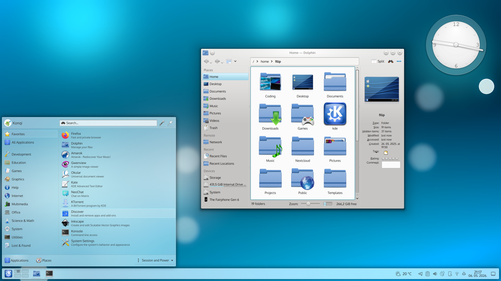
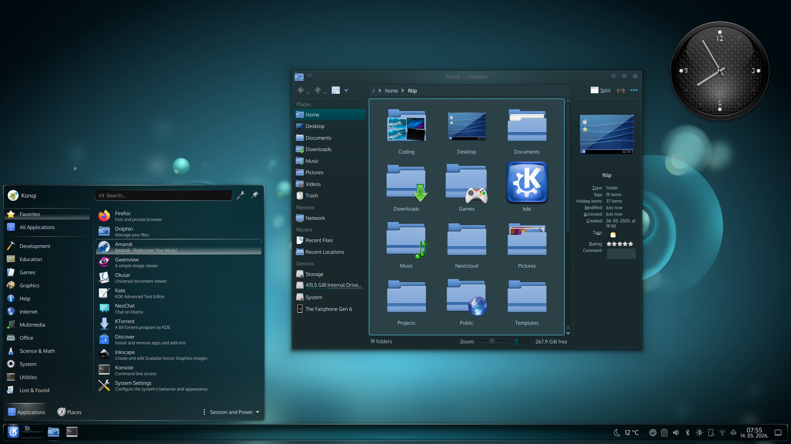

# Oxygen

Oxygen is a classic style for [KDE Plasma](https://kde.org/plasma-desktop/). Once the default style in KDE 4, it is now offered as an optional package.

## Components

This repository contains many parts of Oxygen, such as:

* Color schemes, located under [/color-schemes](/color-schemes).
* Cursors, located under [/cursors](/cursors).
* Air and Oxygen desktop themes, located under [/desktoptheme](/desktoptheme).
* Window decorations, located under [/kdecoration](/kdecoration).
* Application style, located under [/kstyle](/kstyle).
* Wallpapers, located under [/wallpapers](/wallpapers).

## Oxygen Icons

The Oxygen icon set is recommended for use alongside the rest of the theme:

* [Oxygen Icons](https://invent.kde.org/frameworks/oxygen-icons) - contains the icon set associated with the Oxygen style.

## Building

The easiest way to make changes and test Oxygen during development is to [build it with kde-builder](https://develop.kde.org/docs/getting-started/building).

When building Oxygen manually, keep in mind that the Qt5 and Qt6 versions will be built by default. To control which versions are built, use the `BUILD_QT5` and `BUILD_QT6` CMake variables.

## Contributing

Like other projects in the KDE ecosystem, contributions are welcome from all. This repository is managed in [KDE Invent](https://invent.kde.org/plasma/oxygen), our GitLab instance.

* Want to contribute code? See the [GitLab wiki page](https://community.kde.org/Infrastructure/GitLab) for a tutorial on how to send a merge request.
* Reporting a bug? Please submit it on the [KDE Bugtracking System](https://bugs.kde.org/enter_bug.cgi?format=guided&product=oxygen). Please do not use the Issues tab to report bugs.
* Is there a part of Oxygen that's not translated? See the [Getting Involved in Translation wiki page](https://community.kde.org/Get_Involved/translation) to see how
you can help translate!

If you get stuck or need help with anything at all, head over to the [KDE New Contributors room](https://go.kde.org/matrix/#/#kde-welcome:kde.org) on Matrix. For questions about Oxygen, please ask in the [Oxygen Telegram room](https://t.me/OxygenSquared).
